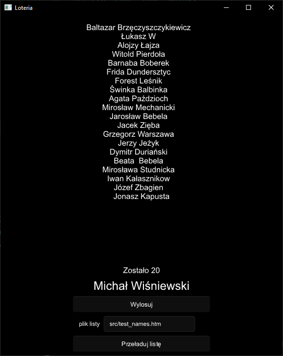
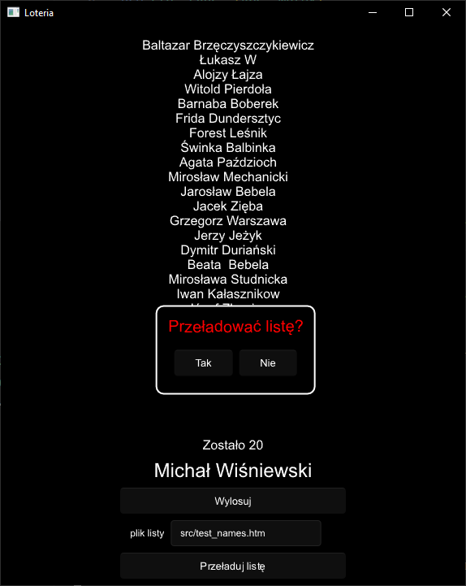

# Lottery

The project aims to automate the player drawing process for FNM events organized by Gralnia. The list of players comes from an HTML list generated by Eventlink and is used to run a lottery in the application. Each lottery draw is immediately logged to file, so it can be continued manually in case of system failure.

## Usage

Application configuration is done through the `config.toml` file. In this file, we provide:

- the path from which data for drawing is fetched

## Architecture

### Config

The configuration is read from the `config.toml` file. If the configuration fails for any reason, the program panics.

### Name Provider

#### Provider

The Provider trait allows for easy exchange of name parsers. The only requirement is the implementation of the `fn get_names(&self) -> Result<Vec<String>, std::io::Error>` function.

#### HTML Provider

Currently, the only implemented provider is the HTML parser from Eventlink `src/names/html.rs`. An example file can be found in `src/test_names.htm`. The parser is designed to find the starting marker and begin adding lines of text until it finds the ending marker.

If, for any reason, the list is shorter than 2, the file does not open, etc., parsing will fail, and an error message will be returned to the client.
