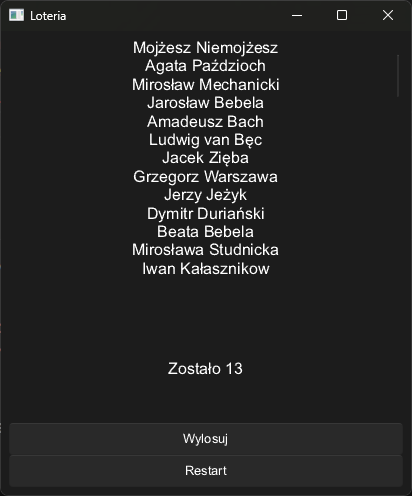
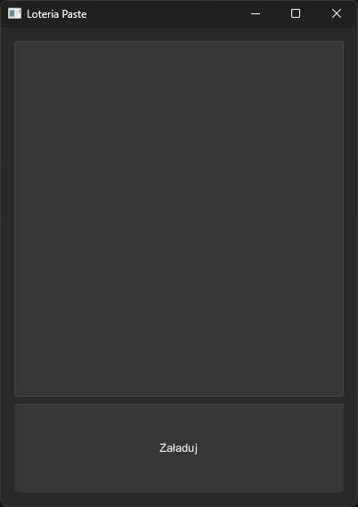

# Lottery

The project aims to automate the player drawing process for FNM events organized by Gralnia.

The list of players is either:

- parsed from an HTML file generated by Eventlink
- pasted from a plaintext list of names, one per line.

Each lottery draw is immediately logged to file, so it can be continued manually in case of system failure.

## Usage

Application configuration is done through the `config.toml` file. In this file, we provide:

- type of name source, either "file" or "paste"
- optionally, the path to the file with the name list

## Architecture

### Config

The configuration is read from the `config.toml` file. If the configuration fails for any reason, the program panics.

### Name Provider

#### Provider

The Provider trait allows for easy exchange of name parsers. The only requirement is the implementation of the `fn get_names(&self) -> Result<Vec<String>, std::io::Error>` function.

#### HTML Provider

An example file from Eventlink can be found in `src/test_names.htm`. The parser is designed to find the starting marker and begin adding lines of text until it finds the ending marker.

If, for any reason, the list is shorter than 2, the file does not open, etc., parsing will fail, and an error message will be returned to the client.

#### Paste provider

The paste provider opens a separate window before the lottery window into which a plaintext list can be pasted. Each name should be on a spearate line. Leading and trailing whitespace is removed.
